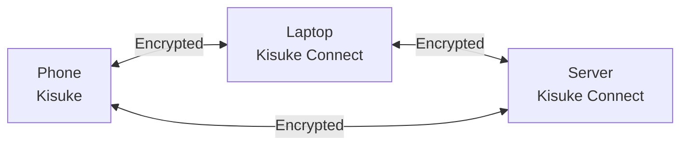
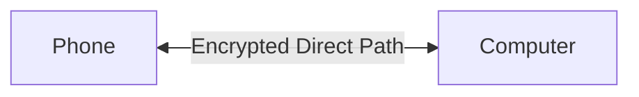
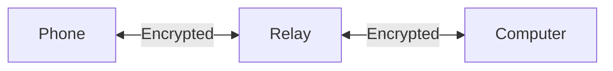

## Overview

There are two parts to Kisuke:

- **Kisuke** — the mobile app (iOS/Android) you use to code, run a terminal, and chat with AI
- **Kisuke Connect** — a lightweight daemon you install on your desktop or server that acts as the other end of the connection

Once both are signed in to the same account, they find each other automatically over an end-to-end encrypted connection. No VPN, no port forwarding, no firewall rules required.

## How It Works

Kisuke Connect runs on your desktop or server and exposes your terminal, files, and editor to the Kisuke mobile app — securely, from anywhere.

## Quick Setup Guide

1. **Install Kisuke Connect** on your computer ([macOS](/installation/mac), [Windows](/installation/windows), or [Linux](/installation/linux))
2. **Sign in** with your account
3. **Install Kisuke** on your mobile device ([iOS](/installation/ios) or [Android](/installation/android))
4. **Sign in** with the same account — your devices automatically discover each other and connect

<Tip>
The connection is automatic once you're signed in on both devices. They just find each other and connect securely.
</Tip>

## Key Benefits

### Zero Configuration

Just sign in on both devices and they find each other automatically. Kisuke Connect handles:

- NAT traversal
- Firewall penetration
- DNS resolution
- Key exchange

### End-to-End Encrypted

All traffic between your devices is end-to-end encrypted — relay servers and coordination servers never see your data:

- **WireGuard-based protocol** for fast, secure tunnels
- **X25519** key exchange
- **ChaCha20-Poly1305** encryption

### Global Relay Network

When a direct peer-to-peer connection isn't possible (strict firewalls, carrier-grade NAT), Kisuke routes traffic through its relay network spanning **14+ regions worldwide** — keeping latency low regardless of where you are.

When direct connection isn't possible:

<Note>
Even relayed traffic is end-to-end encrypted. Relay servers cannot read your data.
</Note>

### Works Anywhere

Kisuke Connect works through:

- Home networks
- Corporate firewalls
- Mobile data (LTE/5G)
- Coffee shop WiFi
- Hotel networks
- Carrier-grade NAT

## Use Cases

### Remote Development

Access your development machine from anywhere. Run builds, execute tests, and use terminals on your powerful desktop — all from your phone on the train.

### Server Access

Connect to servers in your home lab, cloud VMs, or office machines without exposing ports to the internet. No bastion hosts. Just connect via Kisuke Connect.

### Multi-Device Workflow

Work seamlessly across devices:

- Start a build on your laptop
- Check progress from your phone
- Fix a bug from your tablet
- All connected, all the time

## How It Compares

<table>
  <thead>
    <tr>
      <th>Feature</th>
      <th>Kisuke Connect</th>
      <th>Traditional VPN</th>
    </tr>
  </thead>
  <tbody>
    <tr>
      <td>Zero config</td>
      <td>&#10003;</td>
      <td>&#10007;</td>
    </tr>
    <tr>
      <td>NAT traversal</td>
      <td>&#10003;</td>
      <td>Sometimes</td>
    </tr>
    <tr>
      <td>End-to-end encrypted</td>
      <td>&#10003;</td>
      <td>&#10003;</td>
    </tr>
    <tr>
      <td>Works on mobile</td>
      <td>&#10003;</td>
      <td>Sometimes</td>
    </tr>
    <tr>
      <td>Global relay network</td>
      <td>&#10003; (14+ regions)</td>
      <td>&#10007;</td>
    </tr>
    <tr>
      <td>No server required</td>
      <td>&#10003;</td>
      <td>&#10007;</td>
    </tr>
  </tbody>
</table>

## Next Steps

<CardGroup cols={2}>
  <Card title="The Relay System" icon="arrows-rotate" href="/concepts/relay-system">
    Learn about relay servers and NAT traversal.
  </Card>
  <Card title="Security" icon="shield" href="/concepts/security">
    Understand Kisuke's security model.
  </Card>
</CardGroup>
