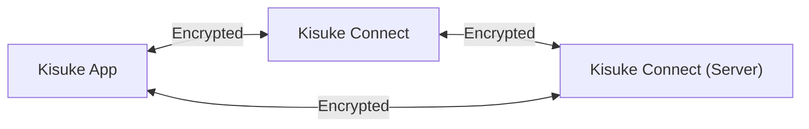
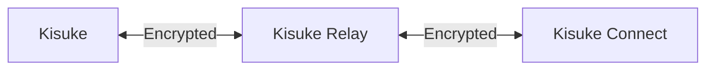

Kisuke Connect is a lightweight service that runs on your desktop or server and acts as the bridge between your machine and the Kisuke app. It exposes your terminal, files, and editor over an end-to-end encrypted connection — letting you access your development environment from anywhere.

<Info>
New to Kisuke? Follow the [Quickstart](/quickstart) to get everything set up in minutes.
</Info>

## How It Works

Kisuke Connect maintains a persistent encrypted tunnel between your devices. When you open a terminal, edit a file, or browse the web through Kisuke, the traffic flows through this tunnel — routed via Kisuke's global relay network for reliable connectivity from any network.

## Key Benefits

### Zero Configuration

Just sign in on both devices and they find each other automatically. Kisuke Connect handles:

- NAT traversal
- Firewall penetration
- DNS resolution
- Key exchange

### End-to-End Encrypted

All traffic between your devices is end-to-end encrypted — relay servers and coordination servers never see your data. Kisuke uses the **Noise Protocol Framework** for its secure tunnels, the same cryptographic foundation that WireGuard is built on:

- **Noise Protocol** for authenticated key exchange and session establishment
- **X25519** key exchange
- **ChaCha20-Poly1305** encryption

### Global Relay Network

All traffic routes through Kisuke's relay network spanning **14+ regions worldwide** — keeping latency low regardless of where you are.

<Note>
Relay servers cannot decrypt your traffic. Everything is end-to-end encrypted — relay servers only forward encrypted packets.
</Note>

### Works Anywhere

Kisuke Connect works through:

- Home networks
- Corporate firewalls
- Mobile data (LTE/5G)
- Coffee shop WiFi
- Hotel networks
- Carrier-grade NAT

## Use Cases

### Remote Development

Access your development machine from anywhere. Run builds, execute tests, and use terminals on your powerful desktop — all from your phone on the train.

### Server Access

Connect to servers in your home lab, cloud VMs, or office machines without exposing ports to the internet. No bastion hosts. Just connect via Kisuke Connect.

### Multi-Device Workflow

Work seamlessly across devices:

- Start a build on your laptop
- Check progress from your phone
- Fix a bug from your tablet
- All connected, all the time

## Next Steps

<CardGroup cols={2}>
  <Card title="The Relay System" icon="arrows-rotate" href="/concepts/relay-system">
    Learn about relay servers and NAT traversal.
  </Card>
  <Card title="Security" icon="shield" href="/concepts/security">
    Understand Kisuke's security model.
  </Card>
</CardGroup>
