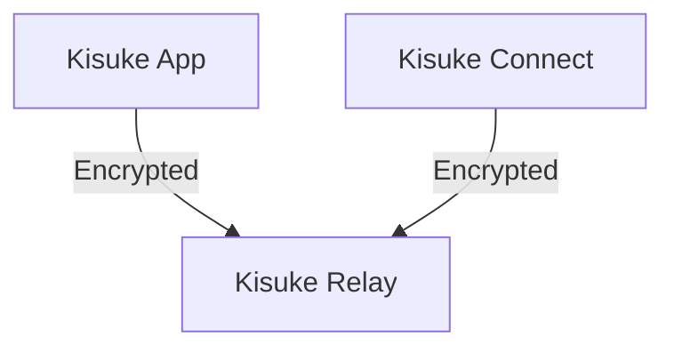

## Overview

All traffic between your Kisuke devices routes through Kisuke's relay network — a global network of encrypted relay servers (DERP — Designated Encrypted Relay for Packets). This ensures connectivity regardless of your network environment, without any port forwarding, firewall rules, or VPN configuration.

## How Relays Work

## Relay Network

Kisuke operates relay servers across **14+ regions worldwide**. Your devices automatically connect to the nearest relay for the lowest possible latency.

## Performance

### Relayed Connection
- Latency: +10-50ms depending on relay distance
- Bandwidth: Limited only by your internet connection

## Monitoring

Check your connection status in the Kisuke app:

1. Go to **Connect** > **Devices**
2. Tap on a connected device
3. View connection details

## Next Steps

<CardGroup cols={1}>
  <Card title="Security" icon="shield" href="/concepts/security">
    Learn about encryption and security.
  </Card>
</CardGroup>
