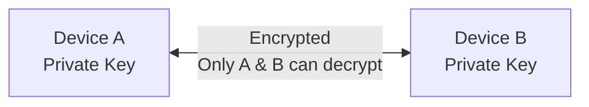

## Overview

Security is fundamental to Kisuke. All communications between your devices are encrypted end-to-end, and we follow industry best practices to protect your data.

## End-to-End Encryption

All traffic between your devices is encrypted using modern cryptographic protocols:

- **Key Exchange** - X25519 elliptic curve Diffie-Hellman
- **Encryption** - ChaCha20-Poly1305 AEAD
- **Authentication** - Ed25519 signatures

## Zero Trust Architecture

Kisuke operates on zero-trust principles:

- **No implicit trust** - Every connection is verified
- **Device verification** - Each device has a unique cryptographic identity
- **Account binding** - Devices are bound to your authenticated account

## Authentication

Kisuke supports authentication through trusted identity providers:

- **Claude** (Anthropic)
- **Google**
- **OpenAI**

This means:

- No passwords to manage for Kisuke
- Leverage existing security (2FA, etc.) from your provider
- Single sign-on across all your devices

## Data Handling

### What Kisuke Stores

- Device identities and public keys
- Connection metadata (for routing)
- Account associations

### What Kisuke NEVER Stores

- Your code or files
- Terminal commands or output
- AI conversation content
- Any decrypted traffic

<Note>
Your data flows directly between your devices. Kisuke servers only facilitate connections—they never see your actual data.
</Note>

## Auth Keys

For server deployments, auth keys provide secure headless authentication:

- **Scoped** - Keys can be limited to specific capabilities
- **Rotatable** - Generate new keys and revoke old ones
- **Auditable** - Track which keys are used where

### Best Practices

- Generate unique keys for each server
- Rotate keys regularly (every 90 days recommended)
- Revoke keys immediately if compromised
- Use environment variables, not command-line arguments

## Network Security

### Firewall Recommendations

Kisuke Connect works through most firewalls with no configuration needed. For optimal performance, allow outbound TCP on port 443.

### How Traffic Flows

All traffic routes through Kisuke's encrypted relay network. Relay servers only forward encrypted packets — they cannot decrypt your traffic.

Relay servers **only see**:
- Encrypted blobs
- Which device to forward packets to

Relay servers **cannot see**:
- Your terminal commands
- Your code
- Your files
- Anything meaningful about your traffic

## Security Reporting

Found a security vulnerability? Please report it responsibly:

- Email: security@kisuke.app
- Do not disclose publicly until addressed

